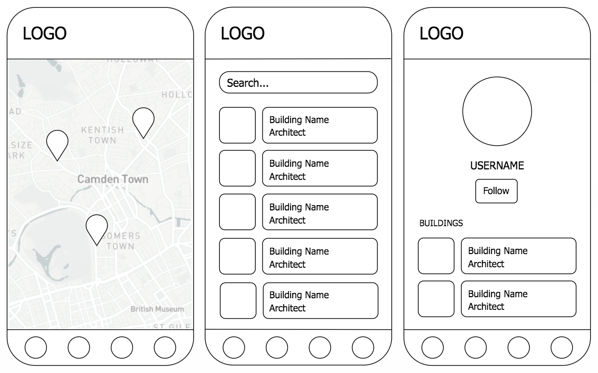
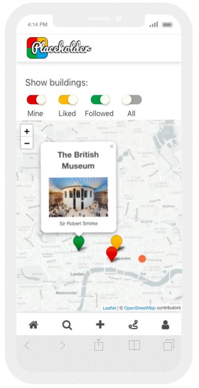

#   WDI Project Four: Placeholder

## Brief
* Build a MERN (MongoDB, Express, React, Node.js) stack web application by making your own backend and your own front-end
* Use an Express API to serve your data from a Mongo database
* Consume your API with a separate front-end built with React
* Be a complete product which most likely means multiple relationships and CRUD functionality for at least two models
* Have automated tests for at least one RESTful resource on the back-end, and at least one classical and one functional component on the front-end. Improve your employability by demonstrating a good understanding of testing principals.

**Timeframe**: 1 week

## Overview

[View on Heroku](https://placeholder-architecture.herokuapp.com/)

This was my fourth and final project during the WDI course at General Assembly (full time 12-week immersive). For this project, I paired up with one of my classmates to create Placeholder, an architecture mapping app, where users can pin their favourite buildings to a map, follow like-minded users and discover other architectural gems by location on a map of the world. Users can also create 'tours' by grouping buildings into curated collections, with the ability to add a description and receive comments.

This project was completed in week 12 of the 12-week WDI course at General Assembly. As we started learning React in Week 11, the key learning points from this project centred on consolidating my knowledge of React.


## Planning

### Trello
During the planning stage of this project, we chose to use Trello to organise and coordinate our progress. This enabled us to track our work, stay on schedule, and monitor each others' movements when we weren't working in the same place. We divided the tasks into MVP (due on day 3 of the project), MVP+ (due on day 5), MVP++ (desirable features that we would attempt to include, time allowing). This system was helpful in focusing our priorities and creating a list of to dos that we could work through.


### Wireframes




## Technologies Used

* React
* JavaScript (ES6)
* HTML5
* SCSS
* Bulma CSS Framework
* Git
* GitHub
* Bcrypt
* JWT
* Mongoose
* Heroku
* Trello
* Yarn
* Chai
* Mocha
* Leaflet.js map
* OpenStreetMap API
* Mapbox API

## Wins and Challenges

### Wins
I am pleased with how I managed to create the separate toggle buttons to show the various buildings on the home page map. I categorised the buildings by 'my', 'liked', 'followed' and 'all' to show the user's own buildings, buildings the've liked, the buildings of users that they follow, and all remaining buildings uploaded to Placedholder.



See below here for some of the code for this action, using 'liked' buildings as an example. The getLikedBuildings function selects all buildings, then maps through the array of objects, and pushes any buildings that the user has previously liked into an empty array. This array is then set to state as likedBuildings.

```javascript
getLikedBuildings() {
  const likedBuildings = [];
  axios.get('/api/buildings')
    .then(result => {
      result.data.map(function(object) {
        if(object.likes.includes(currentUserId)) {
          likedBuildings.push(object);
        }
      });
      this.setState({ likedBuildings: likedBuildings});
    });
}

handleLikedButtonToggle() {
  this.getLikedBuildings();
  this.setState({ likedBuildingsStatus: !this.state.likedBuildingsStatus, likedBuildings: this.state.likedBuildings });
}
```

## Bugs
* Profile button in nav bar not working when viewing another user's profile page
* Page not refreshing when user clicks on their followed users image on the profile page
* Markers not clearing when unsleected in teh home page

## Future Work
* Fix bugs
* Allow users to click attending on tours
* Center tour map on the area where the selected buildings are pinned
* Option to add multiple images to a building, displayed in a gallery
* Search map by location and building
* Filter buildings by architectural style
